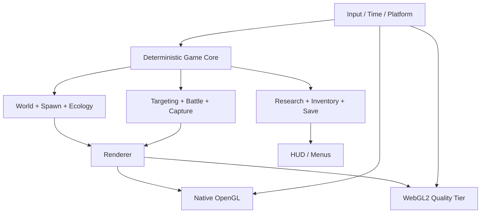

# Pokémon World: Field Research — 游戏策划设计文档

> - 版本：0.4（Phase 3 持续打磨；Phase 4 首切片已完成）
> - 日期：2026-08-27
> - 状态：设计基线与增量实施记录
> - 项目性质：大学毕业作业与个人作品集项目，非官方 Pokémon 产品

### 实施记录

- 2026-08-25：新增平台无关的 `GameSession`，以 60 Hz 固定步长驱动玩家物理、AI、战斗、捕捉、动画与昼夜时间；Native 和 Web 共用同一套模拟调度。
- 主循环已把 `simulateStep()` 与每帧绘制分开；长帧会限制单帧模拟次数并报告丢弃时间，避免恢复窗口或浏览器标签页后出现更新风暴。
- 固定步长、时间累积、分帧一致性、非法时间输入、长帧限制与 reset 已有独立自动化测试。当前共有 36 个原生测试目标。
- 渲染插值因现有模型状态尚未保留前后快照，本切片只预留 `interpolationAlpha`，没有伪造插值效果。
- 2026-08-25：README 与 Web 首屏已加入非官方、教育作品集、无个人/玩法数据收集声明，并说明浏览器存档只保存在 local storage。
- 2026-08-27：存档已演进到 `PW_SAVE_V6`。V2 新增研究是否已提交，V3 加入三个物种研究任务计数，V4 持久化研究等级与剩余诱饵，V5 记录月影足迹与赤岩瞭望两项一次性区域调查，V6 再记录 Alpha 巢穴是否已解决；进行中的 Alpha 遭遇是瞬时状态，不写入存档。解析器保留真实 V1–V5 分支。已提交的 V3 调查会在迁移时按结算分数补判一次 Observer 解锁，其他新增字段使用安全默认值。测试覆盖当前版、五代迁移、未知旧版、未来新版、超大载荷、错位字段、越界计数与跨字段篡改。
- `HudTelemetry` 现在是平台无关、可验证和可独立测试的完整快照；Web HUD 每 120 ms 只跨越一次 C++/JS 边界，并由一个 JSON 对象更新全部状态。
- Pages CI 已加入全新 Chrome profile 的干净存储启动检查；只有构建后的 WASM 把首屏从 `Autosave starting` 更新到 `Autosave ready` 才允许部署。该检查仍需下一次 GitHub Actions 运行确认。
- 2026-08-25：新增平台无关的 `CaptureProjectile`。按住 `C` 会实时蓄力并显示由同一弹道函数生成的预测弧线，松开后才消耗 Poké Ball；球在 60 Hz 模拟中对 Pokémon 球体、三角高度场地形和岩石柱体做 swept collision，最早接触地形或岩石时不再触发捕捉概率。
- Native 冒烟已确认一次真实地面 miss：库存从 10 变为 9，球停在碰撞点并显示红色失败环。2026-08-26 又新增 `capture-aim` 与 `capture-hit` 两个确定性 Native 捕帧入口：前者锁定真实目标、保持 72% 蓄力并断言生产预测路径有效，后者释放最小蓄力球、以 60 Hz 经过生产 swept collision 命中目标并停在真实吸收阶段。首张蓄力图暴露水平小圆环在第三人称低机位下几乎压成细线，现改为朝向镜头的空中节点、地面距离投影和橙色落点标记；复拍后蓄力方向与距离可辨认。QA 投球显式禁止写入存档，运行前后玩家存档时间未变化。真实人工连续路线仍需补齐。
- 2026-08-25：新增平台无关的 `PokemonPerception`。每只野生 Pokémon 现在按物种配置视距、水平视锥、垂直容差与听觉半径；正面目视和移动噪声会连续累积警觉，刺激消失后逐步衰减。胆小型先观察再逃跑，Umbreon 先警告再追击，不再只依赖固定距离一帧触发。
- 警觉度与背后命中已经进入同一套捕捉概率：高警觉降低成功率，投球起点位于目标背后时获得奖励。Native 状态文本与 Web 目标 HUD 共用 `HudTelemetry` 显示警觉条和 `BACK BONUS` 窗口；警觉是遭遇瞬时状态，不写入长期存档。
- 2026-08-26：新增实体 Field Camp。帐篷、工作台、补给箱、旗帜和起降圈均为原创程序化低多边形资产，拥有玩家碰撞、Pokémon 导航避让和安全区规则；Camp HUD 持续显示方向、距离与可交互状态。真实 `.app` 首屏走查发现原安全区只阻止战斗收集、没有抑制 Pokémon 感知和核心区导航，夜间会在帐篷旁出现威胁圈；现已在玩家位于营地时屏蔽野生感知刺激，并用 7.2 米共享导航排除圈把地面 Pokémon 留在完整交互区之外。重启后的真实窗口确认营地内不再出现威胁圈。
- 捕捉达到目标后不再立即冻结。玩家必须返回营地、在起降圈内落地并按 `F` 提交调查；结算按捕捉、击败和研究目标计算分数，恢复 Charizard、补满 Poké Ball，并把提交状态写入当前存档。纯逻辑测试覆盖距离、交互资格、结算分数与补给恢复。
- 2026-08-26：Field Research 从四个通用计数扩展为七项任务。新增“无伤捕捉 Eevee”“记录 Bulbasaur 逃跑”“记录 Umbreon 领地警告”三条物种任务，分别由真实捕捉结果和 AI 状态转换触发；每条只在本次调查首次完成时记入，进度现由 V6 存档、统一 `HudTelemetry`、Web 任务面板和营地结算分数贯通。
- 2026-08-26：研究等级 0→1 与首个研究工具已接通。营地结算达到 700 分会永久解锁 Observer，并为本次及后续调查补给 2 个诱饵；按 `L` 可在营地外落地部署，诱饵持续 14 秒、吸引 18 米内低警觉 Eevee，并为 3.5 米内目标提供捕捉加成。等级、库存、部署状态和倒计时从 V4 起持久化，当前由 V6 存档、Native 状态、统一 `HudTelemetry`、Web HUD、世界环形反馈与纯逻辑测试贯通。
- 2026-08-26：感知已接入真实世界遮挡。地形高度、岩石以及营地帐篷/工作台/补给箱会阻断视锥，近距噪声仍可穿过视觉遮挡；某只地面 Pokémon 进入警戒时，只向 11 米内、同物种、低警觉且彼此视线通畅的同伴传播警报，2.5 秒全局冷却阻止同一帧连锁扩散。Native/Web 状态文本和独立 Web 音效会区分单体与群体警报。
- 2026-08-26：Phase 3 首个生态切片把 5 分钟昼夜循环接入生产 AI。`PokemonEcology` 用连续 daylight 值插值，避免黄昏跨阈值跳变；Eevee 与 Bulbasaur 白天游荡更快、夜间收敛，Umbreon 夜间扩大视觉与听觉领地、更快积累且更慢消退警觉，Wild Charizard 暂时保持中性。Native 标题和 Native/Web 共用摘要显示 Day/Twilight/Night 及当前活跃物种提示；独立规则测试与行为集成测试覆盖日夜边界，10 分钟世界模拟现在完整经历两轮昼夜。真实 `.app` 自然运行暴露标题只随状态消息刷新、夜景几乎全黑，现已改为每 0.5 秒刷新时段，并提高冷色环境光、雾和天空底色；复验确认同一窗口由 Day 自动切为 Night，营地、玩家、地形和远处 Pokémon 在夜间仍可辨认。
- 2026-08-27：Phase 3 首个区域可读性切片新增月影林缘与赤岩高地两组方向性地标。6 棵深青色低多边形月影树位于营地前方左侧，3 座红岩晶石塔位于右侧高地；5 部件、93 三角面的原创 OBJ 可由 `tools/generate_landmarks.py` 确定性重建。地标布局由 `WorldLayout` 统一提供，并接入玩家碰撞、Pokémon 导航、视线与战斗遮挡、Poké Ball 预测/命中以及低成本接触阴影，不是只绘制背景模型。首轮地面捕帧暴露晶石塔被山脊遮住，专用 `landmarks` 空中场景随后确认同一画面可同时读取左右两组轮廓。
- 2026-08-27：三生态区现由平台无关的 `WorldRegion` 共享中心、内外半径、地表色调和连续混合权重。真实地形 shader 在风语草甸的亮绿草地、月影林缘的冷青地表和赤岩高地的红褐土层之间平滑过渡；同一空间规则让 Eevee/Bulbasaur 从草甸、Umbreon 从林缘外圈、Wild Charizard 从高地上空确定性出生，并保留营地 8 米安全距离。区域归属、过渡带归一化和 4 组 seed 的物种出生已有自动化测试；最新空中捕帧可同时辨认三种地表与两组地标。
- 2026-08-27：`WorldLayout` 当前提供 9 段共享道路：月影支线 4 段通往脚印观察点，赤岩支线 5 段经过瞭望点并继续延伸到 Alpha 巢穴。道路宽度、连续端点和羽化覆盖由纯逻辑测试约束；真实地形 shader 读取同一组线段，让冷灰林间路与暖褐高地路沿高度场起伏，不使用漂浮贴片。四个兴趣点使用不同颜色的地面标记和低空信标；专用 `trails` 高空场景断言全部标记连接到道路，并在一次后移复拍后让中央分叉、左右调查终点和路线同时可读。
- 2026-08-27：道路终点已从视觉锚点升级为两项真实区域调查。月影足迹要求玩家在 Twilight/Night、落地且进入 2.4 米标记后按 `F` 记录；赤岩瞭望点不限制时段，但同样要求真实抵达并落地。战斗、投球、失败或已提交状态不能误触发，同一地点只首次计分；两项将 Field Research 从 7 项扩展为 9 项，各为营地结算增加 50 分，并贯通 V6 存档、统一 HUD、Web 任务面板、提示音和完成后的蓝白标记。首次真实捕帧暴露原终点分别被岩石遮挡和位于陡坡，现已沿共享道路迁移到同生态区内的可落地缓坡，并用 1.4 米八方向高差断言锁定最大 0.5 米。`moonshadow-survey` 与 `redrock-survey` 场景走生产 `F` 分发、断言不重复计分、验证 HUD 后再捕捉实际完成画面。
- 2026-08-27：Phase 4 的 Alpha 巢穴首切片已接通。完成月影足迹与赤岩瞭望后，玩家可在赤岩高地的绯红巢穴环内落地并按 `F` 激活 Alpha Charizard；激活后雷达和软锁定独占该目标，渲染模型明显大于普通 Wild Charizard。玩家可通过战斗击败或投球捕获来解决遭遇，结果单独记录，不增加普通调查的 caught/defeated 计数。`resolved` 由 V6 持久化，未完成的 `active` 状态不持久化。该切片只提供单阶段遭遇与通用结算，不能视为完整 Phase 4 或成熟的多阶段 Boss。
- 2026-08-27：昼夜出生池已接入生产固定步长。每个槽位用物种、ID 与连续 daylight 确定是否在场：同一地点白天固定呈现 5 只 Umbreon 与 24 只 Eevee/Bulbasaur，夜间切换为 24 只 Umbreon 与 9 只草甸物种，Wild Charizard 保持全天候。休眠槽位保留捕捉、血量和存档身份，但从锁定、雷达、碰撞、群体警报、投球、遭遇和渲染中统一排除；正在战斗或捕捉的目标会钉住到交互结束，避免中途消失。`ecology-day`/`ecology-night` 用同一机位生成确定性对照画面；首轮夜景仍过暗，第二轮提高共享冷色月光、雾与天空基线后，地形、地标、主角和近中距离野生 Pokémon 均可辨认。
- 2026-08-27：A/D 反向回归的根因是控制器转向符号被改动时，旧测试也同步改成只验证世界坐标，未覆盖玩家模型的实际侧倾方向。现已恢复渲染约定，并加入“输入 → 玩家飞行动画 body roll”的跨层回归：A 必须向画面左侧倾，D 必须向右侧倾。
- 2026-08-26：Phase 2 首个战斗切片已接入真实空间判定。Ember 是 14 米窄球形弹道，Air Slash 是 20 米宽弹道，Flamethrower 是 10.5 米近距锥形；目标、三角高度场地形、岩石和营地实体按最早接触结算。打空或被遮挡不再扣血，目标仍可反击，投射物、锥形火焰、命中环和受击动作都使用真实结果。Native 状态与 Web 招式栏同步显示形状和射程，纯逻辑测试覆盖三种几何、擦边、超距和遮挡。
- 2026-08-26：三招式现已拥有独立 startup/active/recovery、命中硬直和移动限制。Ember 为 0.18/0.30/0.18 秒且保留 80% 机动，Air Slash 为 0.32/0.40/0.36 秒且保留 45% 机动，Flamethrower 为 0.52/0.68/0.72 秒并在出招阶段完全限制常规移动；敌方预警阶段恢复完整移动与闪避。发射原点、朝向、世界碰撞和反击资格统一在 active 开始时结算，因此 startup 中的移动不会继续使用按键瞬间的旧位置。命中才会追加对应 stagger，打空不会伪造受击停顿。
- 2026-08-26：完美闪避反击窗口已接通。只有攻击落点结算前 0.08–0.32 秒启动且最终成功避开的闪避才算完美；当前战斗恢复结束后锁定原攻击者并开放 1.6 秒窗口。窗口内下一次已就绪招式获得 35% 伤害和 0.55 倍 startup，使用、超时、目标失效或新遭遇都会清除窗口；Native 状态、统一 HUD 倒计时和 Web 独立音效提供反馈。
- 2026-08-26：敌方 Bite、Vine Whip、Tackle 与 Wing Attack 已迁移到与玩家招式相同的空间碰撞规则。四招分别使用近战突进、线形弹道或宽弹道，并配置独立射程、体积和危险半径；攻击在 active 开始时锁定玩家位置，先碰到地形、岩石或营地实体会在真实落点终止，不造成伤害或伪造受击。危险圈、突进/弹道、命中特效、状态提示和 Web 音效都读取同一结算结果。
- 2026-08-26：两类主动野生遭遇已形成可测试的核心动作。Umbreon 保持“领地警告 → 地面追击 → Bite → 冷却”，空中 Wild Charizard 新增“发现警告 → 保持 11–16 米盘旋并对齐高度 → Wing Attack → 3.2 秒冷却”；垂直差超过 8 米时不会隔空发起攻击。状态转换、攻击门槛和冷却已有确定性测试，实机镜头、可读性和数值手感仍需可视走查。
- 2026-08-27：10 分钟无渲染世界模拟已扩展为 3 个确定性 seed、每个重复两次，共 60 分钟模拟时间。测试以 60 Hz 更新与实机一致的 48 只地面和 8 只空中 Pokémon，使用生产共享的岩石、营地、两组地标、区域出生和完整昼夜生态，连续检查有限数值、世界边界、实体穿透、持续重叠、Wander/Flee 停滞、速度上限、状态转换以及 Umbreon/Charizard 攻击冷却循环。接入昼夜出生池后，三个样本分别产生 4784–5481 次状态转换、98–122 次警告、9–18 次逃跑、500–674 次 Umbreon 攻击和 338–546 次 Wild Charizard 攻击；每个样本都稳定得到白天/夜间 Umbreon `5/24`、草甸物种 `24/9`。最小静态障碍净距为 0.0277553 米，零持续重叠，最长非预期停滞为 3.18333 秒。同 seed 的事件计数与最终校验值一致，不同 seed 的校验值互异。该测试覆盖 Pokémon 群体 AI/导航与昼夜过渡稳定性，不代替真实渲染和人工操作走查。
- 2026-08-26：新增完整调查资源与退出路径模拟，直接复用生产 `BattleMechanics`、`BattleSequence`、`CaptureMechanics`、`CaptureSequence`、研究进度、营地恢复与结算规则，并把“捕捉 5 只、初始 10 个 Poké Ball”收敛为共享常量。四个 stealth seed 均完成 5 次捕捉，分别消耗 6–9 球、剩余 1–4 球，在模型时间 386.72–390.92 秒内以 750 分结算并解锁 Observer；另有路线覆盖战斗削弱后捕捉、玩家濒死后回营恢复继续调查，以及 10 球耗尽后明确进入不可恢复的 `OutOfPokeBalls`。每次战斗和捕捉演出都以 60 Hz 推进到真实 `Finished` 阶段。模型为每个目标显式预算 65 秒旅行时间，因此这些结果证明规则、资源和退出路径在该模型下可完成，不等于真实新玩家可在约 390 秒内完成；Phase 1 的人工连续路线仍需执行。
- 2026-08-27：Native 显式 `--qa-capture <path.ppm> --qa-scenario <scenario>` 捕帧入口现有 18 个场景，覆盖营地首帧、道路与观察点全景、月影足迹/赤岩瞭望两项真实区域调查、`alpha-nest` 激活构图、`alpha-capture` 削弱后捕获、空中双地标、同机位日间/夜间生态、蓄力瞄准、真实投球命中与吸收、Umbreon/Wild Charizard 敌方 active、Ember/Air Slash/Flamethrower 玩家 active、完美闪避 impact 与攻击被掩体阻挡。它从 OpenGL front framebuffer 读取真实游戏画面并按正确行序输出 PPM；编码器已有独立测试，正常 Native 循环和 Web 路径默认不启用。捕捉和玩家招式场景都会断言生产路径或碰撞体真实成立；完美闪避会经过控制器 dodge/invulnerability 和 0.08–0.32 秒判定；掩体场景必须解析为真实 `Obstacle`，生态场景必须断言对应时段的优势物种数量关系，道路场景必须断言所有兴趣点连接到路线；两项区域调查还会走生产 `F` 分发并断言不重复计分。`alpha-nest` 断言两项调查解锁、生产 `F` 激活、Alpha 独占雷达/锁定、放大模型和 HUD 契约；`alpha-capture` 将 Alpha 削弱后走生产捕捉结果，断言遭遇已解决、V6 可编码，且普通 caught/defeated 计数均不变化。
- 2026-08-27：macOS Native 目标现在同时生成具有 `com.jayliang.pokemon-world` 应用身份的 `Pokemon World.app` 和兼容原有脚本的 `build/final`。42 个运行资源会打包到 `Contents/Resources`，资源定位器区分显式参数与可验证的 CLI/bundle 回退路径。系统已能按应用身份读取真实窗口，并通过窗口标题变化确认 `F` 营地交互与 `Z` 重力切换事件；当前自动化无法保持按键按下，因此完整移动、飞行、闪避、蓄力投球与连续战斗手感仍保留为人工验收项。
- 实际截图确认 Bite 攻击者定位环、玩家落点危险圈和紫色命中特效可同时读取；首轮 Wing Attack 加法尾迹在空中叠成白斑并遮挡来源，随后改为更小、更分散的 alpha 混合蓝色尾迹，复拍后攻击者轮廓和锁定高度均可辨认。新增玩家招式走查又发现 Air Slash 的 0.75 米宽体积从统一 0.9 米高度释放时会在上坡仅飞行 1.065 米便撞地；现改为 1.45 米翼部释放高度并加入上坡回归测试，同时将白色球状叠加改成半透明蓝色横向切面。Ember、Air Slash 与 Flamethrower 现分别呈现窄弹体、宽切面与连续锥形读法。营地真实出生点移到中心北侧 6 米，仍位于 6.5 米交互区内并与三处设施保持安全距离；三轮复拍后帐篷和补给站退为两侧地标，中央绿色出口保持清晰。

## 1. 执行摘要

### 1.1 产品定位

本项目不尝试复刻一整套正统 Pokémon RPG。目标是做成一段 **20–30 分钟、可以重复游玩的 3D 野外调查垂直切片**：

- 玩家骑乘并直接操控 Charizard，在一个生态保护区中飞行、降落和探索；
- 观察不同 Pokémon 的习性，选择潜行接近、即时战斗或直接捕捉；
- 完成物种研究任务并返回营地结算，解锁更危险的区域和更好的研究工具；
- 用有明确预警、碰撞体和动作时序的即时战斗代替目前较简单的“锁定后播放效果”；
- 保留项目原有的飞行特色，让它成为区别于官方作品和普通 fan game 的核心身份。

工作标题：**Pokémon World: Field Research**。

### 1.2 一句话体验

> 驾驭 Charizard 穿越昼夜变化的野外，寻找、观察、周旋并捕捉拥有不同生态行为的 Pokémon，把每次遭遇转化为可积累的研究成果。

### 1.3 平台结论

**现阶段不移除 Web 支持。**

- Native 桌面版是主要开发与高画质版本；
- WebAssembly/WebGL2 版是作品集试玩版，维持相同核心玩法，但允许降低阴影、粒子、植被密度和渲染距离；
- 核心模拟、AI、战斗、捕捉和存档不得依赖浏览器；平台差异只放在渲染、输入、音频和持久化适配层；
- 达到本文第 15 节的退出条件时，才把 Web 降级为只读演示或停止维护。

当前线上 `.data`、`.wasm` 和 `.js` 合计约 9.4 MB（不含 HTML），GitHub Pages 当前发布成功，规模还没有构成放弃 Web 的理由。

## 2. 调研依据与可借鉴机制

这里提取的是玩法结构，不复制官方关卡、数值、文本、音画资产或源代码。

| 参考作品 | 官方确认的核心机制 | 本项目可借鉴的设计原则 |
| --- | --- | --- |
| Pokémon Legends: Arceus | 寻找、观察、削弱、投球捕捉；不同物种会攻击或逃跑；时段影响出现；研究任务推动 Pokédex 与区域解锁；营地恢复和制作物品 | 捕捉应是“观察性格 → 选择策略 → 执行”的闭环；营地必须是实际世界地点；研究不能只等于累计捕捉数 |
| Pokémon Legends: Z-A | 训练家与 Pokémon 在战斗中实时移动；招式具有时机、射程、范围和生效时间；视线发现与背后偷袭会改变开局优势；白天准备、夜间挑战形成节奏 | 现有实时战斗方向正确，但招式必须拥有启动、有效、恢复、范围和命中体积；昼夜要改变玩法，而不只是颜色 |
| Pokémon Scarlet / Violet | 无缝开放世界、可自由选择路径；同行 Pokémon 可自动拾取和进行 Auto Battle | 地图应提供多个短目标与可见地标；自动战斗适合作为后期便利功能，不应先于手动战斗打磨 |
| New Pokémon Snap | 不同栖息地、隐藏位置和稀有行为；区域研究等级提高后出现新的行为；研究评价基于构图与行为稀有度 | 重访同一区域需要出现新发现；研究任务应奖励观察稀有行为，而非只奖励击败或捕捉 |
| Pokémon Sword / Shield | Wild Area 中通过醒目地标进入高强度 Raid；天气改变可遭遇物种；胜利带来捕捉机会和道具 | 垂直切片后期可加入一个明显可见的 Alpha/Boss 巢穴，作为一次远距离可读的高风险事件 |
| Pokémon: Let’s Go | 捕捉结果受投球时机和落点影响，界面显示捕捉难度 | 投球必须有瞄准、飞行轨迹、命中反馈和风险窗口，不能永远自动命中锁定目标 |

### 2.1 参考来源

- [Pokémon Legends: Arceus — Gameplay](https://legends.arceus.pokemon.com/en-us/gameplay/)
- [Pokémon Legends: Z-A — Gameplay and Battling](https://legends.pokemon.com/en-au/gameplay)
- [Pokémon Scarlet and Pokémon Violet](https://www.pokemon.com/uk/pokemon-video-games/pokemon-scarlet-and-pokemon-violet)
- [Scarlet / Violet — Let’s Go 与自动战斗（官方日文站）](https://www.pokemon.co.jp/ex/sv/ja/features/220907_01/)
- [New Pokémon Snap — Explore](https://newpokemonsnap.pokemon.com/en-us/explore/)
- [New Pokémon Snap — Create Your Photodex](https://newpokemonsnap.pokemon.com/en-gb/create-photodex/)
- [Pokémon Sword / Shield — Max Raid Battles](https://swordshield.pokemon.com/en-us/gameplay/max-raid-battles/how-to-max-raid/)
- [Pokémon: Let’s Go — How to Play](https://pokemonletsgo.pokemon.com/en-us/how-to-play/index.html)

## 3. 现有版本审计

### 3.1 已有能力

当前版本已经具备可继续演进的基础：

- C++14、OpenGL、GLFW，Emscripten 编译为 WebAssembly/WebGL2；
- 一个高度图野外场景，第三人称跟随相机；
- Charizard 飞行、重力切换、落地、闪避和碰撞；
- 48 个地面 Pokémon 与 8 个飞行 Pokémon 实例；
- Charizard、Umbreon、Bulbasaur、Eevee 四个物种；
- 软锁定、三招式、属性克制、血量、反击、濒死与恢复；
- 不同性格的基础 AI：游荡、警戒、追击、逃跑；
- 岩石、边界、地形、玩家与地面 Pokémon 动态碰撞；
- 捕捉概率、捕捉演出、Poké Ball 库存；
- 昼夜光照、雾、天空和 Field Radar；
- Field Research、自动存档、失败恢复；
- 36 个原生自动化测试、HUD/投射物/战斗体积/区域调查与 Alpha 规则/感知/昼夜生态/世界地标布局/生态区混合与出生/视线遮挡/群体警报/营地/研究成长/诱饵/资源定位/多 seed 长世界模拟/完整调查资源与退出路径模拟/帧捕获编码契约测试与 GitHub Pages 自动部署。

### 3.2 与成熟垂直切片之间的主要差距

| 层面 | 当前差距 | 对体验的影响 |
| --- | --- | --- |
| 核心循环 | 实体营地、调查、回营结算与失败恢复均已接通，但还没有一条经过人工连续走查的新玩家路线 | 自动化证明规则可闭环，实际路线引导、时长和返程节奏仍可能暴露问题 |
| 捕捉 | 已有按住/松开、预测弧线、真实弹道和遮挡，并有确定性蓄力与真实命中捕帧，但连续人工操作路线尚未补齐 | 规则与关键帧已有证据，瞄准手感仍缺人工连续操作证据 |
| 战斗 | 玩家三招、完美闪避、掩体阻挡、两类敌方 active 和模拟退出路径均已有确定性证据，但仍缺完整连续遭遇与数值手感走查 | 单帧和规则闭环已有证据，连续操作节奏仍可能暴露问题 |
| AI | 只有少量通用状态，物种行为差异不足 | 48 个实例看起来仍像重复单位 |
| 世界 | 已有实体营地、三种连续地表材质、两组方向地标、按物种分区的出生、两条区域道路、两项区域调查，以及可激活并通过战斗或捕获解决的 Alpha 巢穴首切片；更多微型兴趣点、多阶段 Boss 行为和独立结算奖励仍缺 | 首轮终局空间故事已能走通，但高潮层次、策略分化和重玩差异仍不足 |
| 成长 | 已有 Trainee→Observer 与诱饵解锁，但图鉴条目、后续工具和区域解锁尚未实现 | 已形成最小跨局目标，长期深度仍不足 |
| 动画 | OBJ 部件动画为主，无骨骼、IK、脚步贴地和完整状态机 | 角色动作仍会暴露学生作业感 |
| 画面 | 已有动态主光、雾、三区地表分层和低成本接触阴影，但缺少实时阴影、角色材质分层与后处理 | 大区域色调已可读，但角色与小道具的接地和质感仍会暴露学生作业感 |
| 架构 | 大量运行时、渲染和玩法职责仍集中在 `main.cpp` | 后续每加一个系统都会提高回归风险 |
| 测试 | 已有 3 个 seed 各重复两次的 60 分钟总 Pokémon 群体模拟、四类完整调查资源/退出路径模拟、18 类 Native 确定性捕帧和 Web 干净存储检查，但仍缺真实人工连续路线及自动像素回归 | 规则、资源、群体 AI、区域调查、Alpha 首切片与关键战斗/捕捉帧已有可复查证据，连续操作手感和跨版本画面回归仍可能只在实际游玩时暴露 |

## 4. 目标玩家与体验边界

### 4.1 目标玩家

- 喜欢 Pokémon 野外生态、探索和捕捉的玩家；
- 接受轻量即时动作，但不追求高难 Souls-like 战斗；
- 愿意为稀有行为、不同天气和研究评分重复进入同一区域；
- 作品集访客：无需安装，5 分钟内能理解并体验一次完整遭遇。

### 4.2 本阶段明确不做

- 完整地区、城市、道馆和长篇剧情；
- 数百个物种；
- 线上交换、PVP、多人 Raid 或云端账号；
- 繁殖、复杂个体值、完整技能学习和竞技配队；
- 从商业游戏中提取模型、动画、音效或贴图；
- 为了“看起来功能多”而加入无法打磨的菜单系统。

## 5. 设计支柱

### 5.1 观察先于战斗

玩家先通过姿态、叫声、移动路线和 HUD 提示判断性格，再选择行动。玩家不应对所有物种使用相同的“冲上去攻击再扔球”。

### 5.2 每次遭遇都有空间关系

树、岩石、高差、草丛、风向和视线都应影响接近、躲避、攻击与捕捉。任何战斗判定都必须能对应到可见的命中体或范围。

### 5.3 研究创造重复游玩价值

捕捉一只只是发现物种；观察特定行为、在指定时段找到它、无伤捕捉或记录招式，才逐渐完成研究条目。

### 5.4 易读而非堆特效

攻击预警、目标状态、可捕捉窗口和危险区域应在一眼内区分。光影和粒子首先服务于可读性，其次才是华丽程度。

### 5.5 小地图也要有生态感

垂直切片只做一个地图，但通过三个生态区、昼夜和天气组合，让玩家感觉它是一个会变化的地方，而不是静态模型展厅。

## 6. 核心游戏循环

```text
营地准备
  ↓ 选择研究委托、补给、查看时段/天气
进入野外
  ↓ 雷达与地标只提供方向，不直接给出答案
发现踪迹或 Pokémon
  ↓ 观察性格、距离、警觉度和环境
选择策略
  ├─ 潜行/绕后直接捕捉
  ├─ 诱饵改变行为后捕捉
  └─ 即时战斗削弱后捕捉
获得研究记录与材料
  ↓
继续冒险或返回营地
  ↓ 结算研究分、解锁工具/区域/稀有行为
下一次调查
```

### 6.1 单次游玩节奏

| 时间 | 期望体验 |
| --- | --- |
| 0–2 分钟 | 在营地理解任务，起飞并看到远处地标 |
| 2–6 分钟 | 完成第一次简单观察与捕捉 |
| 6–12 分钟 | 遇到会逃跑或警戒的物种，学习换策略 |
| 12–20 分钟 | 进入夜间或特殊天气，完成高价值研究 |
| 20–30 分钟 | 挑战 Alpha 遭遇或返回营地结算并解锁下一档内容 |

## 7. 世界与关卡

### 7.1 单地图、三生态区

地图总面积不盲目扩大，先做出密度和可读性。

| 区域 | 视觉语言 | 玩法作用 | 建议物种 |
| --- | --- | --- | --- |
| 风语草甸 | 开阔草地、浅坡、零散岩石、营地旗帜 | 教学区；练习飞行、降落、锁定、投球 | Eevee、Bulbasaur |
| 月影林缘 | 树木、草丛、遮挡、狭窄通路 | 潜行、视线和领地行为 | Umbreon、一个新增虫/草系物种 |
| 赤岩高地 | 高差、悬崖、上升气流、巢穴光柱 | 飞行技巧、远程战斗和 Alpha 终局遭遇 | 野生 Charizard、一个新增岩/飞行系物种 |

### 7.2 地标规则

- 玩家从空中应能同时看到至少两个方向性地标；
- 每 20–30 秒移动距离内应出现一个微型兴趣点：材料、脚印、观察点或遭遇；
- 不用隐形墙解释边界：用山脊、风墙、林带或研究区警戒线表达；
- 营地必须有实体帐篷、工作台、补给箱和起降区域，而不是只有按键提示。

### 7.3 时间与天气成为玩法条件

| 条件 | 世界变化 | 玩法变化 |
| --- | --- | --- |
| 白天 | 高能见度、暖色主光 | Eevee/Bulbasaur 更活跃；教学任务优先 |
| 黄昏 | 长阴影、暖冷交界 | 稀有迁徙行为；回营或继续冒险的决策点 |
| 夜间 | 月光、发光植物、低能见度 | Umbreon 领地扩大；高价值研究与更高风险 |
| 小雨 | 湿润材质、柔和雾、雨声 | 火系招式视觉和伤害略受影响；水/草系行为改变 |
| 强风 | 云影加速、粒子偏移、上升气流 | 飞行操控与投球轨迹受轻微影响 |

第一阶段只实现晴天与夜间差异；天气系统放在核心循环稳定之后。

## 8. Pokémon 生态与 AI

### 8.1 感知模型

每只 Pokémon 至少拥有：

- 视锥：距离、水平角、垂直容差；
- 听觉半径：飞行、落地、攻击和碰撞产生不同噪声；
- 警觉值：随可疑事件增加，脱离刺激后缓慢衰减；
- 领地或安全点；
- 昼夜与天气活跃权重；
- 对玩家、同类和环境障碍的动态避让。

### 8.2 性格原型

| 原型 | 行为链 | 玩家解法 |
| --- | --- | --- |
| 胆小 | 吃草/游荡 → 察觉 → 观察 → 逃往安全点 | 绕后、使用遮挡、快速准确投球 |
| 好奇 | 游荡 → 靠近噪声/诱饵 → 短暂停留 | 利用诱饵制造稳定捕捉窗口 |
| 领地型 | 巡逻 → 警告 → 追击 → 攻击 → 冷却 | 读懂预警、闪避、反击或离开领地 |
| 群居型 | 跟随领头者 → 同伴警报扩散 → 集体逃跑 | 分离个体，避免惊动整个群体 |
| Alpha | 守巢 → 远距离警戒 → 多阶段攻击 | 充分准备，利用地形和招式窗口 |

当前 Alpha 首切片只完成“解锁 → 激活 → 独占锁定/雷达 → 通用战斗或捕获解决”；表中的守巢与多阶段攻击仍是后续目标，不应当作已实现行为。

### 8.3 当前四物种的明确身份

- Eevee：好奇型；会靠近落地点，但受到攻击后快速逃离；
- Bulbasaur：胆小型；白天在草甸活动，受惊后奔向植被；
- Umbreon：领地型；夜间感知范围和追击意愿提高；
- Wild Charizard：空中巡逻型；只有在高地或空中接近后进入战斗。

## 9. 即时战斗系统

### 9.1 操作目标

- 保留 `1/2/3` 选择招式、`X` 使用、`Shift` 闪避；
- 新增明确的软锁定视觉和可切换目标，但不让镜头突然吸附；
- 玩家能通过距离、朝向、敌人动作和地形做出判断；
- 命中由实际 hit volume 与时间窗决定，而不是只在动画时间点扣血。

### 9.2 招式数据

每个招式至少配置：

```text
type
power
startupSeconds
activeSeconds
recoverySeconds
cooldownSeconds
range
shape (sphere / capsule / cone / projectile)
projectileSpeed
areaRadius
stagger
movementLock
visualCue
audioCue
```

### 9.3 现有三招式的角色

| 招式 | 战术身份 | 风险 |
| --- | --- | --- |
| Ember | 14 米窄球形弹道；0.18/0.30/0.18 秒；保留 80% 机动 | 擦边容错小，容易被掩体挡住 |
| Air Slash | 20 米宽弹道；0.32/0.40/0.36 秒；保留 45% 机动 | 冷却较长，出招期间转向和位移受限 |
| Flamethrower | 10.5 米持续锥形；0.52/0.68/0.72 秒；常规移动锁定 | 必须靠近目标，冷却长、暴露时间长 |

### 9.4 伤害与可读性

- 属性克制继续保留，但不让倍率淹没操作表现；
- 敌方强攻击必须至少包含预备动作、地面/空间危险提示和声音提示；
- 完美闪避应提供短暂反击窗口，而不只是免疫一次伤害；
- 受击要有停顿、材质闪烁、粒子方向和模型反应；
- 所有远程弹道必须能被看见、被地形阻挡并在命中点结束。

## 10. 捕捉系统

### 10.1 捕捉输入

将当前自动锁定捕捉升级为：

1. 按住 `C` 进入投球瞄准；
2. 屏幕显示预测弧线和捕捉环；
3. 松开 `C` 投掷；
4. Poké Ball 使用连续碰撞检测，先命中地形则失败并消耗球；
5. 命中后根据状态计算捕捉概率并播放摇球演出。

软锁定只提供辅助，不自动修正到必定命中。

### 10.2 捕捉概率因素

```text
基础物种难度
× HP 系数
× 警觉度系数
× 背后命中系数
× 投球距离/精准度系数
× Poké Ball 类型系数
× 状态或诱饵系数
```

### 10.3 失败也产生信息

- 擦边：显示命中误差方向；
- 被发现后挣脱：提示先降低警觉或削弱；
- 被地形挡住：球在实际碰撞点弹落；
- 连续失败：不偷偷增加概率，但研究工具可显示更明确的建议。

## 11. 研究、成长与奖励

### 11.1 研究条目

目标是让每个物种最终拥有 5 类任务，完成任意组合提高研究等级；当前四物种和三条物种专属任务尚未达到这一完整条目规模：

- 发现：首次观察；
- 行为：记录进食、睡眠、逃跑、领地警告或飞行；
- 捕捉：普通、背后、无战斗、指定时段；
- 战斗：见到特定招式、属性克制、无伤击败；
- 生态：在特定区域、天气或时段发现。

### 11.2 研究等级

| 等级 | 解锁 |
| --- | --- |
| 0 — Trainee | 基础球、草甸、基础雷达 |
| 1 — Observer | 行为提示、诱饵、林缘 |
| 2 — Specialist | 改良球、天气预报、高地 |
| 3 — Senior Researcher | Alpha 委托、完整物种条目、评分挑战 |

### 11.3 奖励原则

- 奖励新策略与新信息，不奖励机械重复；
- 同一种行为只在首次或高质量完成时提供主要研究分；
- 物资奖励服务于下一次调查：Poké Ball、诱饵、恢复品、雷达电量；
- 不在本阶段加入随机付费、抽卡或在线经济。

## 12. 营地与失败循环

营地是以下系统的唯一安全入口：

- 恢复 Charizard；
- 补给和制作研究用品；
- 提交研究记录；
- 查看物种条目和下一档任务；
- 选择出发时段；
- 保存、读取和开始新调查。

失败时保留已提交研究；本次尚未提交的材料有部分损失。当前 `F` 是统一的落地区域交互键：在营地读取简报、提交或恢复，在月影/赤岩标记记录区域调查，并在两项调查完成后于绯红巢穴环内激活 Alpha。濒死后的 `F` 回营地仍是过渡实现，最终应表现为 Charizard 返回实体营地并播放简短结算，而不是瞬间传送后只改状态文字。

## 13. UI、音频与画面标准

### 13.1 HUD 层级

1. 生存：HP、危险攻击预警、闪避状态；
2. 当前遭遇：目标 HP、警觉度、捕捉难度、招式冷却；
3. 探索：Field Radar、任务摘要、营地方向；
4. 低优先级信息：详细研究进度放入暂停/图鉴界面。

战斗期间淡化探索 HUD；调查结束后隐藏战斗 HUD。避免所有面板同时抢占画面。

### 13.2 画面升级顺序

1. 正确模型朝向、比例、接地和碰撞；
2. 角色动作状态机与过渡；
3. 主光实时阴影与低成本接触阴影；
4. 材质粗糙度、法线或风格化分层；
5. 雾、天空、云影和天气；
6. 色调映射、轻量 Bloom、受击和捕捉后处理；
7. 在性能预算内增加植被密度与远景层次。

### 13.3 音频

- 为移动、起飞、落地、碰撞、警戒、攻击、命中、投球和摇球提供分层反馈；
- 用环境声区分草甸、林缘和高地；
- 敌方强攻击的关键提示不能只依靠画面；
- 继续使用原创或许可明确的音频，不提取商业游戏素材。

## 14. 技术架构目标

### 14.1 分层



### 14.2 必须从 `main.cpp` 拆出的职责

- `GameSession`：当前调查状态与生命周期；
- `WorldSimulation`：固定步长、实体更新、出生与生态条件；
- `EncounterSystem`：锁定、攻击、受击、捕捉；
- `SceneRenderer`：绘制列表、材质、灯光和特效；
- `HudTelemetry`：将稳定数据结构传给原生标题或 Web HUD；
- `PlatformStorage`：Native 文件与 Web localStorage/IndexedDB；
- `AssetCatalog`：模型、纹理、材质和质量等级。

先移动职责并保持行为不变，再加新玩法；不进行一次性大重写。

### 14.3 模拟规则

- 核心玩法使用固定时间步，例如 60 Hz；
- 渲染插值与模拟分离；
- 随机出生和 AI 测试使用显式 seed；
- 玩家、Pokémon、投射物和球分别拥有碰撞 layer/mask；
- 高速投射物和闪避使用 swept test，避免穿透；
- 存档必须带版本号和迁移路径。

## 15. Web 与 Native 平台策略

### 15.1 为什么现在保留 Web

- 当前实现已经使用 Emscripten 支持的 WebGL2/OpenGL ES 3 友好子集；
- 现有页面和 WebAssembly 已能从 GitHub Pages 稳定加载；
- 线上核心文件约 9.4 MB，当前 Pages 站点离 1 GB 上限很远；
- 点击链接即玩的价值对作品集非常高；
- 计划中的 AI、碰撞、任务和大部分即时战斗属于 CPU 侧普通 C++ 逻辑，不要求放弃 Web。

### 15.2 Web 的实际限制

- WebGL 的安全校验和 JS/WASM 到 GL 的边界调用会提高 CPU 开销；
- 资源预加载包越大，首次进入越慢且线性内存压力越高；
- 浏览器 GPU、驱动和移动设备差异比 Native 更大；
- GitHub Pages 只是静态托管，不适合服务器权威多人游戏；
- GitHub Pages 的发布站点上限为 1 GB、工作流部署超时为 10 分钟，并有软带宽限制；
- 高质量实时阴影、大量透明粒子、高密度植被和大量独立 draw call 必须设置质量档位。

技术依据：

- [Emscripten — OpenGL support](https://emscripten.org/docs/porting/multimedia_and_graphics/OpenGL-support.html)
- [Emscripten — Optimizing WebGL](https://emscripten.org/docs/optimizing/Optimizing-WebGL.html)
- [Emscripten — Deploying compiled pages](https://emscripten.org/docs/compiling/Deploying-Pages.html)
- [GitHub Pages limits](https://docs.github.com/en/pages/getting-started-with-github-pages/github-pages-limits)

### 15.3 双平台质量档

| 能力 | Native High | Web Balanced |
| --- | --- | --- |
| 分辨率 | 1080p，可配置 | 默认 1280×720，按设备缩放 |
| 阴影 | 2–3 cascades 或高分辨率主阴影 | 单级低分辨率阴影 + 接触阴影 |
| 植被 | 高密度、较远绘制 | 实例化、较短绘制距离 |
| 粒子 | 完整密度 | 50–60% 密度 |
| 纹理 | HD | SD/HD 选择，后续按需加载 |
| 后处理 | Bloom + tone mapping + 可选 AO | tone mapping + 轻量 Bloom |
| 目标帧率 | 60 FPS @ 1080p | ≥45 FPS @ 720p；低档 ≥30 FPS |

### 15.4 Web 退出条件

满足以下任一条件，并且两轮针对性优化仍无法解决时，才停止维护完整 Web 游戏：

1. 核心设计必须依赖 WebGL2 不支持且无法合理降级的 GPU 能力；
2. Web Balanced 在目标中端笔记本持续低于 30 FPS；
3. 首次交互资源在常规网络下长期超过 15 秒，拆包和压缩后仍不可接受；
4. Pages 部署持续接近或超过 10 分钟，或站点接近 1 GB；
5. 平台适配占每个功能切片超过约 30% 的开发时间，并连续三个切片发生；
6. Web 降级已经破坏核心循环，而不是只降低画质。

退出后仍保留一个轻量作品页、视频和 Native 下载，不直接删除既有部署历史。

## 16. 性能预算

### 16.1 CPU / GPU

- 核心模拟：60 Hz，单步不超过 6 ms（目标开发机）；
- Web 95 百分位帧时间：不超过 22.2 ms；
- 同时活跃并进行完整 AI 的 Pokémon：先限制在 24，远处实体降低更新频率；
- Web draw calls：目标低于 250/帧；
- 粒子使用池，不在战斗帧创建/删除 GPU 资源；
- 重复模型使用实例化或至少按材质批次排序；
- 视锥、距离和遮挡层级逐步裁剪。

### 16.2 加载

- Web 首次可交互目标：25 Mbps 网络下 ≤8 秒；
- 首屏先加载营地和草甸，林缘、高地与 HD 资产异步加载；
- 资源包按区域或质量档拆分；
- `.wasm`、JS 和数据包确认正确 MIME 与压缩策略；
- 显示真实加载阶段和失败原因，不停在空白 Canvas。

## 17. 测试策略

### 17.1 单元测试

继续保持纯 C++、无 OpenGL 上下文的快速测试：

- 固定步长与时间累积；
- AI 警觉、逃跑、领地、群体警报状态转换；
- 视锥、听觉和昼夜/天气条件；
- 招式 startup/active/recovery/cooldown；
- hitbox/hurtbox、swept projectile 与 layer/mask；
- 投球轨迹、地形碰撞、捕捉概率；
- 研究任务去重、评分、等级解锁；
- 物资消耗、营地结算、失败损失；
- 存档 round trip、非法数据拒绝和版本迁移；
- 生成器 seed 的确定性。

### 17.2 模拟测试

- 以固定 seed 运行 10 分钟无渲染世界模拟；
- 断言实体不穿越边界、地形和静态障碍；
- 断言 Pokémon 不永久重叠或卡死；
- 断言遭遇能退出到安全状态；
- 断言玩家总能在资源允许时完成一次捕捉；
- 记录最大速度、位置、血量和状态转换，失败时输出可复现 seed。

### 17.3 渲染与 Web 烟雾测试

- Native 启动到首帧无 GL error；
- shader 编译与必要 uniform 在 CI 中验证；
- Pages 构建后检查 HTML、JS、WASM、data 的 200 与 MIME；
- 浏览器自动化检查 Canvas 非空、状态到 `Ready`、无 console error；
- 使用干净存储分别覆盖新游戏、恢复存档和损坏存档；
- 至少保留一个低配置/软件渲染回退检查；
- 对主要 HUD 做 1280×720 和移动宽度截图回归。

### 17.4 每个功能切片的完成门槛

1. 明确玩家可见结果；
2. 新规则有自动化测试；
3. Native 完整构建；
4. 全部测试通过；
5. WebAssembly CI 构建通过；
6. 线上资源和关键运行时状态验证；
7. 工作区干净、提交范围单一；
8. README/GDD 与实际行为一致。

## 18. 实施路线

### Phase 0 — 稳定核心与合规（1–2 个切片）

- 在网页和 README 加显著的非官方、教育用途、无数据收集声明；**已于 2026-08-25 完成，并验证桌面与移动首屏可见。**
- 建立 `GameSession` 和固定步长，不改变当前玩法结果；**固定步长基础已于 2026-08-25 完成，渲染插值待实体快照切片接入。**
- 为存档加入显式版本与迁移测试；**V1 版本分派边界已于 2026-08-25 完成；V2/V3 与真实 V1→V2→当前迁移边界已于 2026-08-26 完成。**
- 将 HUD telemetry 从零散 `EM_ASM` 调用整理为稳定数据结构；**已于 2026-08-25 完成，全部 HUD 状态通过一个经过校验的快照发布。**
- 加入 Web 干净存储启动烟雾测试；**已于 2026-08-25 接入 Pages CI，待下一次 Actions 运行确认真实 Web 构建结果。**

**出口条件：** 当前玩法行为不回退；Native/Web 同一核心规则；测试可复现。

### Phase 1 — 捕捉垂直切片（3–5 个切片）

- 实体营地和一次完整“准备 → 调查 → 回营结算”；**核心流程已于 2026-08-26 完成：世界实体、碰撞、安全区、方向 HUD、落地交互、研究计分、补给恢复与持久化均已接通；完整人工路线仍需补一次实机走查。**
- 按住/松开投球、预测弧线、球体 swept collision；**核心规则与 Native 地面 miss 冒烟已于 2026-08-25 完成；2026-08-26 又用确定性 Native 场景补齐 72% 蓄力弧线和最小蓄力真实目标命中/吸收捕帧，并修正弧线可读性。完整人工连续路线仍待补。**
- 警觉值、视锥、背后捕捉奖励；**核心规则、AI 状态转换、捕捉因子与 Web HUD 反馈已于 2026-08-25 完成；地形/岩石/营地遮挡和带冷却的同物种群体警报已于 2026-08-26 接入。遮挡潜行与群体扩散的实机操作路线仍需人工走查。**
- Eevee、Bulbasaur、Umbreon 的差异化研究任务；**首批三条任务已于 2026-08-26 完成：Eevee 要求不先削弱，Bulbasaur 要求触发并记录逃跑，Umbreon 要求接近并记录领地警告；HUD、存档和结算已贯通。后续各物种仍需扩展到发现/行为/捕捉/战斗/生态五类完整条目。**
- 研究等级 0→1 与诱饵解锁；**已于 2026-08-26 完成最小长期循环：700 分结算升级、跨局继承、每局 2 个诱饵、Eevee 吸引、近距捕捉加成、V4 起持久化且当前由 V6 读取/写入，HUD 反馈也已接通；仍需随完整人工路线一起验证操作手感。**

**出口条件：** 新玩家可在 10 分钟内理解并完成一条不依赖战斗的捕捉路线。

### Phase 2 — 即时战斗垂直切片（3–5 个切片）

- 招式空间形状、startup/active/recovery；**已于 2026-08-26 完成：三招式分别配置空间形状、startup、active、player recovery、stagger 与 movement lock，运行时和测试均由同一数据驱动。**
- 弹道与地形碰撞；**玩家三招式与敌方 Bite/Vine Whip/Tackle/Wing Attack 已于 2026-08-26 全部接入目标、地形、岩石和营地实体的最早命中；命中、受击、危险圈与音画反馈共用真实结果。**
- 完美闪避反击窗口；**已于 2026-08-26 完成：0.08–0.32 秒判定、1.6 秒目标锁定窗口、35% 伤害奖励、0.55 倍 startup、HUD 倒计时与独立音效均已接通。**
- 三招式形成明确战术差异；**空间容错、射程、启动、有效期、恢复、硬直、移动限制与冷却均已区分；仍需实机调参。**
- Umbreon 领地遭遇和 Wild Charizard 空中遭遇各一套完整动作；**两套遭遇的警告、追击/盘旋、攻击、冷却与空间结算核心已于 2026-08-26 接通并测试；实机镜头、特效可读性和数值手感仍待走查调参。**

**出口条件：** 所有伤害都能由可见时序和碰撞解释；无脚本瞬移命中。

### Phase 3 — 世界、光影与动作（4–6 个切片）

- 三生态区与地标；**于 2026-08-27 完成首轮：风语草甸、月影林缘和赤岩高地共享连续区域权重，地表色调、物种初始出生、方向地标、碰撞与遮挡已接通；同日又加入营地分叉至两区的真实地形道路、两项可交互区域调查，以及通往 Alpha 巢穴的赤岩延伸段。更多微型兴趣点和区域细节仍待后续切片。**
- 阴影、接触感、材质分层和质量档；
- 动画状态机、转向过渡、脚步贴地/飞行动作；
- 昼夜影响出生与 AI；**AI 活动与感知已于 2026-08-26 接通连续昼夜值；2026-08-27 又完成确定性槽位休眠/恢复、全交互过滤、同机位日夜生态捕帧及跨两轮昼夜长模拟。**
- 环境音和行为音频。

**出口条件：** 同一地点的白天与夜间具有不同可玩内容，而非只换颜色。

### Phase 4 — 终局遭遇与可重玩性（2–4 个切片）

- Alpha 巢穴事件；**首切片已完成两项区域调查解锁、落地 `F` 激活、独占雷达/锁定、放大模型、通用战斗/捕获解决与 V6 resolved 持久化；多阶段 Boss 行为、独立结算奖励和重复挑战变化仍未实现。**
- 研究等级 1→3；**仍未实现。**
- 区域重访时的新行为；
- 统计页、最佳研究分与 20–30 分钟完整路线；
- Native/Web 性能与加载专项优化。

**出口条件：** 一次完整调查有开端、升级、高潮和结算，且至少存在两种有效完成策略。

## 19. 垂直切片验收标准

只有同时满足以下条件，才可以称为“成熟的 3D Pokémon 垂直切片”：

- 1 个连续地图、3 个可辨识生态区、1 个实体营地；
- 至少 6 个物种，其中至少 4 个拥有明显不同的 AI 与研究任务；
- 直接捕捉与战斗削弱捕捉两条完整路线；
- 3 个真正不同的玩家招式与至少 3 类敌方攻击；
- 昼夜改变至少出生、行为和任务中的两项；
- 1 个 Alpha/终局遭遇；
- 研究等级、解锁、物资和营地结算形成长期循环；
- 所有移动、投球、弹道、攻击和镜头拥有稳定碰撞；
- Native 60 FPS 目标与 Web Balanced 可接受帧率达标；
- 自动化覆盖核心规则、长模拟、存档和 Web 启动；
- 线上试玩有明确加载状态、控制说明、免责声明和可恢复存档。

## 20. 法务与资产边界

- Pokémon 名称、角色和官方设计属于其权利人；本项目应保持非商业、教育/作品集定位；
- GitHub Pages 的托管政策只决定站点能否托管，不等于获得 Pokémon IP 授权；
- 不从商业游戏文件提取模型、骨骼、动画、贴图或音频；
- 优先使用原创风格化模型或具备明确展示与再分发许可的资产，并保存许可与 attribution；第三方 fan asset 的作者许可也不能替代 Pokémon 权利人的 IP 授权；
- 网页应显著说明：非官方、与 Nintendo / Creatures / GAME FREAK / The Pokémon Company 无关联、不收集用户数据；
- 若未来商业化，必须更换名称、角色、世界观和全部受保护资产，转为原创 creature-research IP。

## 21. 下一步建议

`GameSession`、合规声明、存档版本边界和 `HudTelemetry` 已经完成。Web 干净存储启动检查也已接入 CI；下一次 Actions 通过后，Phase 0 即可按出口条件验收。

Phase 1 的真实投球、连续碰撞、警觉值、视锥、世界遮挡、群体警报、背后奖励、实体营地结算、首批三条物种研究任务，以及 Trainee→Observer 与诱饵工具已经落地。Phase 2 已完成玩家三招式及敌方 Bite/Vine Whip/Tackle/Wing Attack 的空间形状、射程、世界碰撞、逐招式时序、失败反击、真实命中特效和完美闪避反击窗口；Umbreon 地面领地战与 Wild Charizard 空中攻击航线也已有可测试的核心闭环。Phase 3 已把共享昼夜值接入物种活动、感知和实际在场槽位，并完成风语草甸、月影林缘和赤岩高地的连续地表分层、按物种初始出生、两组可碰撞可遮挡的方向地标、9 段高度场道路，以及月影足迹/赤岩瞭望两项可交互、计分、持久化的区域调查；Eevee/Bulbasaur 白天占优、Umbreon 夜间占优已有规则、生产交互过滤、同机位画面和跨两轮昼夜长模拟证据。Phase 4 目前只完成 Alpha 首切片：两区域调查解锁、生产 `F` 激活、独占雷达/锁定、放大模型、战斗或捕获解决，以及 V6 的 resolved 持久化；`active` 不持久化。18 类 Native front-buffer 场景在此前 16 类基础上新增 `alpha-nest` 与 `alpha-capture`，后者验证削弱后成功捕获且普通 caught/defeated 计数不变。

下一步仍应先在 `.app` 内执行 Phase 1 人工连续路线，并完成最新 Web 构建与线上验证。设计层面继续补 Phase 3 的阴影、材质、动画和音频，同时把 Alpha 从单阶段首切片扩展为多阶段 Boss，并加入独立结算奖励与重复挑战变化。研究等级 1→3、至少 6 个物种及其完整研究条目也仍是成熟垂直切片的未完成验收项，因此不能把当前状态表述为 Phase 4 完成。
