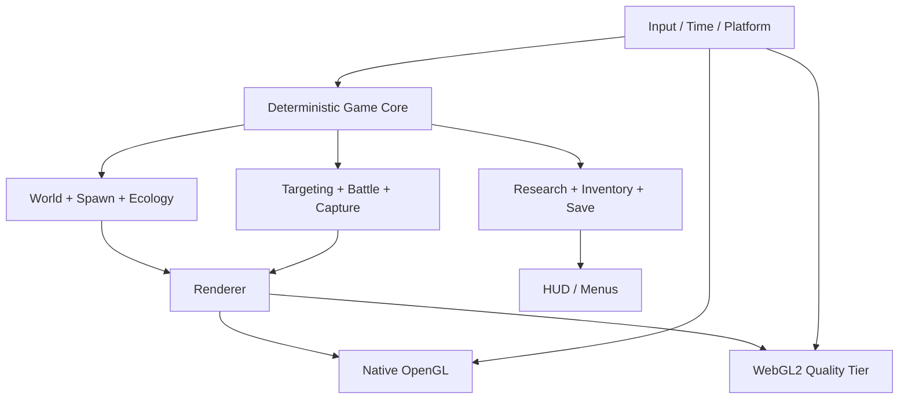

# Pokémon World: Field Research — 游戏策划设计文档

> - 版本：0.1（方向稿）
> - 日期：2026-08-24
> - 状态：用于确定产品方向、技术边界和后续实施顺序
> - 项目性质：个人学习与作品集项目，非官方 Pokémon 产品

## 1. 执行摘要

### 1.1 产品定位

本项目不尝试复刻一整套正统 Pokémon RPG。目标是做成一段 **20–30 分钟、可以重复游玩的 3D 野外调查垂直切片**：

- 玩家骑乘并直接操控 Charizard，在一个生态保护区中飞行、降落和探索；
- 观察不同 Pokémon 的习性，选择潜行接近、即时战斗或直接捕捉；
- 完成物种研究任务并返回营地结算，解锁更危险的区域和更好的研究工具；
- 用有明确预警、碰撞体和动作时序的即时战斗代替目前较简单的“锁定后播放效果”；
- 保留项目原有的飞行特色，让它成为区别于官方作品和普通 fan game 的核心身份。

工作标题：**Pokémon World: Field Research**。

### 1.2 一句话体验

> 驾驭 Charizard 穿越昼夜变化的野外，寻找、观察、周旋并捕捉拥有不同生态行为的 Pokémon，把每次遭遇转化为可积累的研究成果。

### 1.3 平台结论

**现阶段不移除 Web 支持。**

- Native 桌面版是主要开发与高画质版本；
- WebAssembly/WebGL2 版是作品集试玩版，维持相同核心玩法，但允许降低阴影、粒子、植被密度和渲染距离；
- 核心模拟、AI、战斗、捕捉和存档不得依赖浏览器；平台差异只放在渲染、输入、音频和持久化适配层；
- 达到本文第 15 节的退出条件时，才把 Web 降级为只读演示或停止维护。

当前线上 `.data`、`.wasm` 和 `.js` 合计约 9.4 MB（不含 HTML），GitHub Pages 当前发布成功，规模还没有构成放弃 Web 的理由。

## 2. 调研依据与可借鉴机制

这里提取的是玩法结构，不复制官方关卡、数值、文本、音画资产或源代码。

| 参考作品 | 官方确认的核心机制 | 本项目可借鉴的设计原则 |
| --- | --- | --- |
| Pokémon Legends: Arceus | 寻找、观察、削弱、投球捕捉；不同物种会攻击或逃跑；时段影响出现；研究任务推动 Pokédex 与区域解锁；营地恢复和制作物品 | 捕捉应是“观察性格 → 选择策略 → 执行”的闭环；营地必须是实际世界地点；研究不能只等于累计捕捉数 |
| Pokémon Legends: Z-A | 训练家与 Pokémon 在战斗中实时移动；招式具有时机、射程、范围和生效时间；视线发现与背后偷袭会改变开局优势；白天准备、夜间挑战形成节奏 | 现有实时战斗方向正确，但招式必须拥有启动、有效、恢复、范围和命中体积；昼夜要改变玩法，而不只是颜色 |
| Pokémon Scarlet / Violet | 无缝开放世界、可自由选择路径；同行 Pokémon 可自动拾取和进行 Auto Battle | 地图应提供多个短目标与可见地标；自动战斗适合作为后期便利功能，不应先于手动战斗打磨 |
| New Pokémon Snap | 不同栖息地、隐藏位置和稀有行为；区域研究等级提高后出现新的行为；研究评价基于构图与行为稀有度 | 重访同一区域需要出现新发现；研究任务应奖励观察稀有行为，而非只奖励击败或捕捉 |
| Pokémon Sword / Shield | Wild Area 中通过醒目地标进入高强度 Raid；天气改变可遭遇物种；胜利带来捕捉机会和道具 | 垂直切片后期可加入一个明显可见的 Alpha/Boss 巢穴，作为一次远距离可读的高风险事件 |
| Pokémon: Let’s Go | 捕捉结果受投球时机和落点影响，界面显示捕捉难度 | 投球必须有瞄准、飞行轨迹、命中反馈和风险窗口，不能永远自动命中锁定目标 |

### 2.1 参考来源

- [Pokémon Legends: Arceus — Gameplay](https://legends.arceus.pokemon.com/en-us/gameplay/)
- [Pokémon Legends: Z-A — Gameplay and Battling](https://legends.pokemon.com/en-au/gameplay)
- [Pokémon Scarlet and Pokémon Violet](https://www.pokemon.com/uk/pokemon-video-games/pokemon-scarlet-and-pokemon-violet)
- [Scarlet / Violet — Let’s Go 与自动战斗（官方日文站）](https://www.pokemon.co.jp/ex/sv/ja/features/220907_01/)
- [New Pokémon Snap — Explore](https://newpokemonsnap.pokemon.com/en-us/explore/)
- [New Pokémon Snap — Create Your Photodex](https://newpokemonsnap.pokemon.com/en-gb/create-photodex/)
- [Pokémon Sword / Shield — Max Raid Battles](https://swordshield.pokemon.com/en-us/gameplay/max-raid-battles/how-to-max-raid/)
- [Pokémon: Let’s Go — How to Play](https://pokemonletsgo.pokemon.com/en-us/how-to-play/index.html)

## 3. 现有版本审计

### 3.1 已有能力

当前版本已经具备可继续演进的基础：

- C++14、OpenGL、GLFW，Emscripten 编译为 WebAssembly/WebGL2；
- 一个高度图野外场景，第三人称跟随相机；
- Charizard 飞行、重力切换、落地、闪避和碰撞；
- 48 个地面 Pokémon 与 8 个飞行 Pokémon 实例；
- Charizard、Umbreon、Bulbasaur、Eevee 四个物种；
- 软锁定、三招式、属性克制、血量、反击、濒死与恢复；
- 不同性格的基础 AI：游荡、警戒、追击、逃跑；
- 岩石、边界、地形、玩家与地面 Pokémon 动态碰撞；
- 捕捉概率、捕捉演出、Poké Ball 库存；
- 昼夜光照、雾、天空和 Field Radar；
- Field Research、自动存档、失败恢复；
- 17 个原生自动化测试与 GitHub Pages 自动部署。

### 3.2 与成熟垂直切片之间的主要差距

| 层面 | 当前差距 | 对体验的影响 |
| --- | --- | --- |
| 核心循环 | 目标主要是“抓到 5 只”，营地只有快捷恢复语义 | 缺少准备、出发、调查、回收、结算的节奏 |
| 捕捉 | 锁定后自动执行，缺少真实瞄准和投掷误差 | 捕捉结果更像菜单判定，缺少操作成就感 |
| 战斗 | 已有时序与闪避，但命中仍偏脚本化，招式空间差异有限 | 不同招式的手感和战术选择不够明确 |
| AI | 只有少量通用状态，物种行为差异不足 | 48 个实例看起来仍像重复单位 |
| 世界 | 单一大草地，缺少生态分区、道路、营地、巢穴和可读地标 | 飞行探索没有“我要去哪里”的空间故事 |
| 成长 | 无研究等级、图鉴条目、工具升级、区域解锁 | 单局结束后没有长期目标 |
| 动画 | OBJ 部件动画为主，无骨骼、IK、脚步贴地和完整状态机 | 角色动作仍会暴露学生作业感 |
| 画面 | 有动态主光与雾，但缺少实时阴影、接触阴影、后处理和材质分层 | 模型难以稳定地“站进”环境里 |
| 架构 | 大量运行时、渲染和玩法职责仍集中在 `main.cpp` | 后续每加一个系统都会提高回归风险 |
| 测试 | 核心纯逻辑覆盖较好，但缺少长时间模拟、渲染烟雾和 Web 端自动检查 | 复杂遭遇可能只在实际游玩时暴露问题 |

## 4. 目标玩家与体验边界

### 4.1 目标玩家

- 喜欢 Pokémon 野外生态、探索和捕捉的玩家；
- 接受轻量即时动作，但不追求高难 Souls-like 战斗；
- 愿意为稀有行为、不同天气和研究评分重复进入同一区域；
- 作品集访客：无需安装，5 分钟内能理解并体验一次完整遭遇。

### 4.2 本阶段明确不做

- 完整地区、城市、道馆和长篇剧情；
- 数百个物种；
- 线上交换、PVP、多人 Raid 或云端账号；
- 繁殖、复杂个体值、完整技能学习和竞技配队；
- 从商业游戏中提取模型、动画、音效或贴图；
- 为了“看起来功能多”而加入无法打磨的菜单系统。

## 5. 设计支柱

### 5.1 观察先于战斗

玩家先通过姿态、叫声、移动路线和 HUD 提示判断性格，再选择行动。玩家不应对所有物种使用相同的“冲上去攻击再扔球”。

### 5.2 每次遭遇都有空间关系

树、岩石、高差、草丛、风向和视线都应影响接近、躲避、攻击与捕捉。任何战斗判定都必须能对应到可见的命中体或范围。

### 5.3 研究创造重复游玩价值

捕捉一只只是发现物种；观察特定行为、在指定时段找到它、无伤捕捉或记录招式，才逐渐完成研究条目。

### 5.4 易读而非堆特效

攻击预警、目标状态、可捕捉窗口和危险区域应在一眼内区分。光影和粒子首先服务于可读性，其次才是华丽程度。

### 5.5 小地图也要有生态感

垂直切片只做一个地图，但通过三个生态区、昼夜和天气组合，让玩家感觉它是一个会变化的地方，而不是静态模型展厅。

## 6. 核心游戏循环

```text
营地准备
  ↓ 选择研究委托、补给、查看时段/天气
进入野外
  ↓ 雷达与地标只提供方向，不直接给出答案
发现踪迹或 Pokémon
  ↓ 观察性格、距离、警觉度和环境
选择策略
  ├─ 潜行/绕后直接捕捉
  ├─ 诱饵改变行为后捕捉
  └─ 即时战斗削弱后捕捉
获得研究记录与材料
  ↓
继续冒险或返回营地
  ↓ 结算研究分、解锁工具/区域/稀有行为
下一次调查
```

### 6.1 单次游玩节奏

| 时间 | 期望体验 |
| --- | --- |
| 0–2 分钟 | 在营地理解任务，起飞并看到远处地标 |
| 2–6 分钟 | 完成第一次简单观察与捕捉 |
| 6–12 分钟 | 遇到会逃跑或警戒的物种，学习换策略 |
| 12–20 分钟 | 进入夜间或特殊天气，完成高价值研究 |
| 20–30 分钟 | 挑战 Alpha 遭遇或返回营地结算并解锁下一档内容 |

## 7. 世界与关卡

### 7.1 单地图、三生态区

地图总面积不盲目扩大，先做出密度和可读性。

| 区域 | 视觉语言 | 玩法作用 | 建议物种 |
| --- | --- | --- | --- |
| 风语草甸 | 开阔草地、浅坡、零散岩石、营地旗帜 | 教学区；练习飞行、降落、锁定、投球 | Eevee、Bulbasaur |
| 月影林缘 | 树木、草丛、遮挡、狭窄通路 | 潜行、视线和领地行为 | Umbreon、一个新增虫/草系物种 |
| 赤岩高地 | 高差、悬崖、上升气流、巢穴光柱 | 飞行技巧、远程战斗和 Alpha 终局遭遇 | 野生 Charizard、一个新增岩/飞行系物种 |

### 7.2 地标规则

- 玩家从空中应能同时看到至少两个方向性地标；
- 每 20–30 秒移动距离内应出现一个微型兴趣点：材料、脚印、观察点或遭遇；
- 不用隐形墙解释边界：用山脊、风墙、林带或研究区警戒线表达；
- 营地必须有实体帐篷、工作台、补给箱和起降区域，而不是只有按键提示。

### 7.3 时间与天气成为玩法条件

| 条件 | 世界变化 | 玩法变化 |
| --- | --- | --- |
| 白天 | 高能见度、暖色主光 | Eevee/Bulbasaur 更活跃；教学任务优先 |
| 黄昏 | 长阴影、暖冷交界 | 稀有迁徙行为；回营或继续冒险的决策点 |
| 夜间 | 月光、发光植物、低能见度 | Umbreon 领地扩大；高价值研究与更高风险 |
| 小雨 | 湿润材质、柔和雾、雨声 | 火系招式视觉和伤害略受影响；水/草系行为改变 |
| 强风 | 云影加速、粒子偏移、上升气流 | 飞行操控与投球轨迹受轻微影响 |

第一阶段只实现晴天与夜间差异；天气系统放在核心循环稳定之后。

## 8. Pokémon 生态与 AI

### 8.1 感知模型

每只 Pokémon 至少拥有：

- 视锥：距离、水平角、垂直容差；
- 听觉半径：飞行、落地、攻击和碰撞产生不同噪声；
- 警觉值：随可疑事件增加，脱离刺激后缓慢衰减；
- 领地或安全点；
- 昼夜与天气活跃权重；
- 对玩家、同类和环境障碍的动态避让。

### 8.2 性格原型

| 原型 | 行为链 | 玩家解法 |
| --- | --- | --- |
| 胆小 | 吃草/游荡 → 察觉 → 观察 → 逃往安全点 | 绕后、使用遮挡、快速准确投球 |
| 好奇 | 游荡 → 靠近噪声/诱饵 → 短暂停留 | 利用诱饵制造稳定捕捉窗口 |
| 领地型 | 巡逻 → 警告 → 追击 → 攻击 → 冷却 | 读懂预警、闪避、反击或离开领地 |
| 群居型 | 跟随领头者 → 同伴警报扩散 → 集体逃跑 | 分离个体，避免惊动整个群体 |
| Alpha | 守巢 → 远距离警戒 → 多阶段攻击 | 充分准备，利用地形和招式窗口 |

### 8.3 当前四物种的明确身份

- Eevee：好奇型；会靠近落地点，但受到攻击后快速逃离；
- Bulbasaur：胆小型；白天在草甸活动，受惊后奔向植被；
- Umbreon：领地型；夜间感知范围和追击意愿提高；
- Wild Charizard：空中巡逻型；只有在高地或空中接近后进入战斗。

## 9. 即时战斗系统

### 9.1 操作目标

- 保留 `1/2/3` 选择招式、`X` 使用、`Shift` 闪避；
- 新增明确的软锁定视觉和可切换目标，但不让镜头突然吸附；
- 玩家能通过距离、朝向、敌人动作和地形做出判断；
- 命中由实际 hit volume 与时间窗决定，而不是只在动画时间点扣血。

### 9.2 招式数据

每个招式至少配置：

```text
type
power
startupSeconds
activeSeconds
recoverySeconds
cooldownSeconds
range
shape (sphere / capsule / cone / projectile)
projectileSpeed
areaRadius
stagger
movementLock
visualCue
audioCue
```

### 9.3 现有三招式的角色

| 招式 | 战术身份 | 风险 |
| --- | --- | --- |
| Ember | 快速、低伤害、短冷却，用于试探和打断 | 射程与范围较小 |
| Air Slash | 中距离扇形/宽弹道，适合移动目标 | 启动时间中等，近身容易被反击 |
| Flamethrower | 持续锥形高伤害，压制 Alpha | 移动受限、冷却长、暴露时间长 |

### 9.4 伤害与可读性

- 属性克制继续保留，但不让倍率淹没操作表现；
- 敌方强攻击必须至少包含预备动作、地面/空间危险提示和声音提示；
- 完美闪避应提供短暂反击窗口，而不只是免疫一次伤害；
- 受击要有停顿、材质闪烁、粒子方向和模型反应；
- 所有远程弹道必须能被看见、被地形阻挡并在命中点结束。

## 10. 捕捉系统

### 10.1 捕捉输入

将当前自动锁定捕捉升级为：

1. 按住 `C` 进入投球瞄准；
2. 屏幕显示预测弧线和捕捉环；
3. 松开 `C` 投掷；
4. Poké Ball 使用连续碰撞检测，先命中地形则失败并消耗球；
5. 命中后根据状态计算捕捉概率并播放摇球演出。

软锁定只提供辅助，不自动修正到必定命中。

### 10.2 捕捉概率因素

```text
基础物种难度
× HP 系数
× 警觉度系数
× 背后命中系数
× 投球距离/精准度系数
× Poké Ball 类型系数
× 状态或诱饵系数
```

### 10.3 失败也产生信息

- 擦边：显示命中误差方向；
- 被发现后挣脱：提示先降低警觉或削弱；
- 被地形挡住：球在实际碰撞点弹落；
- 连续失败：不偷偷增加概率，但研究工具可显示更明确的建议。

## 11. 研究、成长与奖励

### 11.1 研究条目

每个物种有 5 类任务，完成任意组合提高研究等级：

- 发现：首次观察；
- 行为：记录进食、睡眠、逃跑、领地警告或飞行；
- 捕捉：普通、背后、无战斗、指定时段；
- 战斗：见到特定招式、属性克制、无伤击败；
- 生态：在特定区域、天气或时段发现。

### 11.2 研究等级

| 等级 | 解锁 |
| --- | --- |
| 0 — Trainee | 基础球、草甸、基础雷达 |
| 1 — Observer | 行为提示、诱饵、林缘 |
| 2 — Specialist | 改良球、天气预报、高地 |
| 3 — Senior Researcher | Alpha 委托、完整物种条目、评分挑战 |

### 11.3 奖励原则

- 奖励新策略与新信息，不奖励机械重复；
- 同一种行为只在首次或高质量完成时提供主要研究分；
- 物资奖励服务于下一次调查：Poké Ball、诱饵、恢复品、雷达电量；
- 不在本阶段加入随机付费、抽卡或在线经济。

## 12. 营地与失败循环

营地是以下系统的唯一安全入口：

- 恢复 Charizard；
- 补给和制作研究用品；
- 提交研究记录；
- 查看物种条目和下一档任务；
- 选择出发时段；
- 保存、读取和开始新调查。

失败时保留已提交研究；本次尚未提交的材料有部分损失。当前 `F` 回营地机制可以作为过渡，但最终应表现为 Charizard 返回实体营地并播放简短结算，而不是瞬间传送后只改状态文字。

## 13. UI、音频与画面标准

### 13.1 HUD 层级

1. 生存：HP、危险攻击预警、闪避状态；
2. 当前遭遇：目标 HP、警觉度、捕捉难度、招式冷却；
3. 探索：Field Radar、任务摘要、营地方向；
4. 低优先级信息：详细研究进度放入暂停/图鉴界面。

战斗期间淡化探索 HUD；调查结束后隐藏战斗 HUD。避免所有面板同时抢占画面。

### 13.2 画面升级顺序

1. 正确模型朝向、比例、接地和碰撞；
2. 角色动作状态机与过渡；
3. 主光实时阴影与低成本接触阴影；
4. 材质粗糙度、法线或风格化分层；
5. 雾、天空、云影和天气；
6. 色调映射、轻量 Bloom、受击和捕捉后处理；
7. 在性能预算内增加植被密度与远景层次。

### 13.3 音频

- 为移动、起飞、落地、碰撞、警戒、攻击、命中、投球和摇球提供分层反馈；
- 用环境声区分草甸、林缘和高地；
- 敌方强攻击的关键提示不能只依靠画面；
- 继续使用原创或许可明确的音频，不提取商业游戏素材。

## 14. 技术架构目标

### 14.1 分层



### 14.2 必须从 `main.cpp` 拆出的职责

- `GameSession`：当前调查状态与生命周期；
- `WorldSimulation`：固定步长、实体更新、出生与生态条件；
- `EncounterSystem`：锁定、攻击、受击、捕捉；
- `SceneRenderer`：绘制列表、材质、灯光和特效；
- `HudTelemetry`：将稳定数据结构传给原生标题或 Web HUD；
- `PlatformStorage`：Native 文件与 Web localStorage/IndexedDB；
- `AssetCatalog`：模型、纹理、材质和质量等级。

先移动职责并保持行为不变，再加新玩法；不进行一次性大重写。

### 14.3 模拟规则

- 核心玩法使用固定时间步，例如 60 Hz；
- 渲染插值与模拟分离；
- 随机出生和 AI 测试使用显式 seed；
- 玩家、Pokémon、投射物和球分别拥有碰撞 layer/mask；
- 高速投射物和闪避使用 swept test，避免穿透；
- 存档必须带版本号和迁移路径。

## 15. Web 与 Native 平台策略

### 15.1 为什么现在保留 Web

- 当前实现已经使用 Emscripten 支持的 WebGL2/OpenGL ES 3 友好子集；
- 现有页面和 WebAssembly 已能从 GitHub Pages 稳定加载；
- 线上核心文件约 9.4 MB，当前 Pages 站点离 1 GB 上限很远；
- 点击链接即玩的价值对作品集非常高；
- 计划中的 AI、碰撞、任务和大部分即时战斗属于 CPU 侧普通 C++ 逻辑，不要求放弃 Web。

### 15.2 Web 的实际限制

- WebGL 的安全校验和 JS/WASM 到 GL 的边界调用会提高 CPU 开销；
- 资源预加载包越大，首次进入越慢且线性内存压力越高；
- 浏览器 GPU、驱动和移动设备差异比 Native 更大；
- GitHub Pages 只是静态托管，不适合服务器权威多人游戏；
- GitHub Pages 的发布站点上限为 1 GB、工作流部署超时为 10 分钟，并有软带宽限制；
- 高质量实时阴影、大量透明粒子、高密度植被和大量独立 draw call 必须设置质量档位。

技术依据：

- [Emscripten — OpenGL support](https://emscripten.org/docs/porting/multimedia_and_graphics/OpenGL-support.html)
- [Emscripten — Optimizing WebGL](https://emscripten.org/docs/optimizing/Optimizing-WebGL.html)
- [Emscripten — Deploying compiled pages](https://emscripten.org/docs/compiling/Deploying-Pages.html)
- [GitHub Pages limits](https://docs.github.com/en/pages/getting-started-with-github-pages/github-pages-limits)

### 15.3 双平台质量档

| 能力 | Native High | Web Balanced |
| --- | --- | --- |
| 分辨率 | 1080p，可配置 | 默认 1280×720，按设备缩放 |
| 阴影 | 2–3 cascades 或高分辨率主阴影 | 单级低分辨率阴影 + 接触阴影 |
| 植被 | 高密度、较远绘制 | 实例化、较短绘制距离 |
| 粒子 | 完整密度 | 50–60% 密度 |
| 纹理 | HD | SD/HD 选择，后续按需加载 |
| 后处理 | Bloom + tone mapping + 可选 AO | tone mapping + 轻量 Bloom |
| 目标帧率 | 60 FPS @ 1080p | ≥45 FPS @ 720p；低档 ≥30 FPS |

### 15.4 Web 退出条件

满足以下任一条件，并且两轮针对性优化仍无法解决时，才停止维护完整 Web 游戏：

1. 核心设计必须依赖 WebGL2 不支持且无法合理降级的 GPU 能力；
2. Web Balanced 在目标中端笔记本持续低于 30 FPS；
3. 首次交互资源在常规网络下长期超过 15 秒，拆包和压缩后仍不可接受；
4. Pages 部署持续接近或超过 10 分钟，或站点接近 1 GB；
5. 平台适配占每个功能切片超过约 30% 的开发时间，并连续三个切片发生；
6. Web 降级已经破坏核心循环，而不是只降低画质。

退出后仍保留一个轻量作品页、视频和 Native 下载，不直接删除既有部署历史。

## 16. 性能预算

### 16.1 CPU / GPU

- 核心模拟：60 Hz，单步不超过 6 ms（目标开发机）；
- Web 95 百分位帧时间：不超过 22.2 ms；
- 同时活跃并进行完整 AI 的 Pokémon：先限制在 24，远处实体降低更新频率；
- Web draw calls：目标低于 250/帧；
- 粒子使用池，不在战斗帧创建/删除 GPU 资源；
- 重复模型使用实例化或至少按材质批次排序；
- 视锥、距离和遮挡层级逐步裁剪。

### 16.2 加载

- Web 首次可交互目标：25 Mbps 网络下 ≤8 秒；
- 首屏先加载营地和草甸，林缘、高地与 HD 资产异步加载；
- 资源包按区域或质量档拆分；
- `.wasm`、JS 和数据包确认正确 MIME 与压缩策略；
- 显示真实加载阶段和失败原因，不停在空白 Canvas。

## 17. 测试策略

### 17.1 单元测试

继续保持纯 C++、无 OpenGL 上下文的快速测试：

- 固定步长与时间累积；
- AI 警觉、逃跑、领地、群体警报状态转换；
- 视锥、听觉和昼夜/天气条件；
- 招式 startup/active/recovery/cooldown；
- hitbox/hurtbox、swept projectile 与 layer/mask；
- 投球轨迹、地形碰撞、捕捉概率；
- 研究任务去重、评分、等级解锁；
- 物资消耗、营地结算、失败损失；
- 存档 round trip、非法数据拒绝和版本迁移；
- 生成器 seed 的确定性。

### 17.2 模拟测试

- 以固定 seed 运行 10 分钟无渲染世界模拟；
- 断言实体不穿越边界、地形和静态障碍；
- 断言 Pokémon 不永久重叠或卡死；
- 断言遭遇能退出到安全状态；
- 断言玩家总能在资源允许时完成一次捕捉；
- 记录最大速度、位置、血量和状态转换，失败时输出可复现 seed。

### 17.3 渲染与 Web 烟雾测试

- Native 启动到首帧无 GL error；
- shader 编译与必要 uniform 在 CI 中验证；
- Pages 构建后检查 HTML、JS、WASM、data 的 200 与 MIME；
- 浏览器自动化检查 Canvas 非空、状态到 `Ready`、无 console error；
- 使用干净存储分别覆盖新游戏、恢复存档和损坏存档；
- 至少保留一个低配置/软件渲染回退检查；
- 对主要 HUD 做 1280×720 和移动宽度截图回归。

### 17.4 每个功能切片的完成门槛

1. 明确玩家可见结果；
2. 新规则有自动化测试；
3. Native 完整构建；
4. 全部测试通过；
5. WebAssembly CI 构建通过；
6. 线上资源和关键运行时状态验证；
7. 工作区干净、提交范围单一；
8. README/GDD 与实际行为一致。

## 18. 实施路线

### Phase 0 — 稳定核心与合规（1–2 个切片）

- 在网页和 README 加显著的非官方、教育用途、无数据收集声明；
- 建立 `GameSession` 和固定步长，不改变当前玩法结果；
- 为存档加入显式版本与迁移测试；
- 将 HUD telemetry 从零散 `EM_ASM` 调用整理为稳定数据结构；
- 加入 Web 干净存储启动烟雾测试。

**出口条件：** 当前玩法行为不回退；Native/Web 同一核心规则；测试可复现。

### Phase 1 — 捕捉垂直切片（3–5 个切片）

- 实体营地和一次完整“准备 → 调查 → 回营结算”；
- 按住/松开投球、预测弧线、球体 swept collision；
- 警觉值、视锥、背后捕捉奖励；
- Eevee、Bulbasaur、Umbreon 的差异化研究任务；
- 研究等级 0→1 与诱饵解锁。

**出口条件：** 新玩家可在 10 分钟内理解并完成一条不依赖战斗的捕捉路线。

### Phase 2 — 即时战斗垂直切片（3–5 个切片）

- 招式空间形状、startup/active/recovery；
- 弹道与地形碰撞；
- 完美闪避反击窗口；
- 三招式形成明确战术差异；
- Umbreon 领地遭遇和 Wild Charizard 空中遭遇各一套完整动作。

**出口条件：** 所有伤害都能由可见时序和碰撞解释；无脚本瞬移命中。

### Phase 3 — 世界、光影与动作（4–6 个切片）

- 三生态区与地标；
- 阴影、接触感、材质分层和质量档；
- 动画状态机、转向过渡、脚步贴地/飞行动作；
- 昼夜影响出生与 AI；
- 环境音和行为音频。

**出口条件：** 同一地点的白天与夜间具有不同可玩内容，而非只换颜色。

### Phase 4 — 终局遭遇与可重玩性（2–4 个切片）

- Alpha 巢穴事件；
- 研究等级 1→3；
- 区域重访时的新行为；
- 统计页、最佳研究分与 20–30 分钟完整路线；
- Native/Web 性能与加载专项优化。

**出口条件：** 一次完整调查有开端、升级、高潮和结算，且至少存在两种有效完成策略。

## 19. 垂直切片验收标准

只有同时满足以下条件，才可以称为“成熟的 3D Pokémon 垂直切片”：

- 1 个连续地图、3 个可辨识生态区、1 个实体营地；
- 至少 6 个物种，其中至少 4 个拥有明显不同的 AI 与研究任务；
- 直接捕捉与战斗削弱捕捉两条完整路线；
- 3 个真正不同的玩家招式与至少 3 类敌方攻击；
- 昼夜改变至少出生、行为和任务中的两项；
- 1 个 Alpha/终局遭遇；
- 研究等级、解锁、物资和营地结算形成长期循环；
- 所有移动、投球、弹道、攻击和镜头拥有稳定碰撞；
- Native 60 FPS 目标与 Web Balanced 可接受帧率达标；
- 自动化覆盖核心规则、长模拟、存档和 Web 启动；
- 线上试玩有明确加载状态、控制说明、免责声明和可恢复存档。

## 20. 法务与资产边界

- Pokémon 名称、角色和官方设计属于其权利人；本项目应保持非商业、教育/作品集定位；
- GitHub Pages 的托管政策只决定站点能否托管，不等于获得 Pokémon IP 授权；
- 不从商业游戏文件提取模型、骨骼、动画、贴图或音频；
- 优先使用原创风格化模型或具备明确展示与再分发许可的资产，并保存许可与 attribution；第三方 fan asset 的作者许可也不能替代 Pokémon 权利人的 IP 授权；
- 网页应显著说明：非官方、与 Nintendo / Creatures / GAME FREAK / The Pokémon Company 无关联、不收集用户数据；
- 若未来商业化，必须更换名称、角色、世界观和全部受保护资产，转为原创 creature-research IP。

## 21. 下一步建议

建议下一项实施 **Phase 0 的第一件事：平台无关的 `GameSession` + 固定步长基础**。原因是捕捉、AI、投射物和长时间模拟都依赖稳定时间语义；如果继续把状态堆进 `main.cpp`，后续每个成熟机制都会更难测试和维护。

紧接着做 **真正可操作的投球与连续碰撞检测**。这是当前版本从“课堂演示”跨到“可玩游戏”的最高价值玩法改造。
